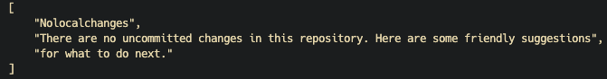

# use-ocr
a repo demo for making images to texts by PaddleOCR

## Install Dependencies

* Anaconda
* Python 3.8.17
* PaddleOCR

## Usage

```shell
$ conda create --name paddle_env python=3.8 --channel https://mirrors.tuna.tsinghua.edu.cn/anaconda/pkgs/free/

$ conda activate paddle_env

$ python3 -m pip install paddlepaddle -i https://mirror.baidu.com/pypi/simple

$ pip install "paddleocr>=2.0.1"

$ cd use-ocr

$ python3 .
```

## Demo

Original Figure


To Texts



## Links

[PaddleOCR Quick Start](https://github.com/PaddlePaddle/PaddleOCR/blob/release/2.7/doc/doc_ch/quickstart.md#11)
